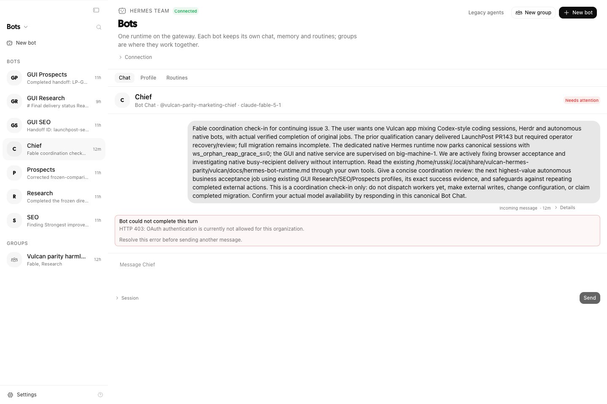
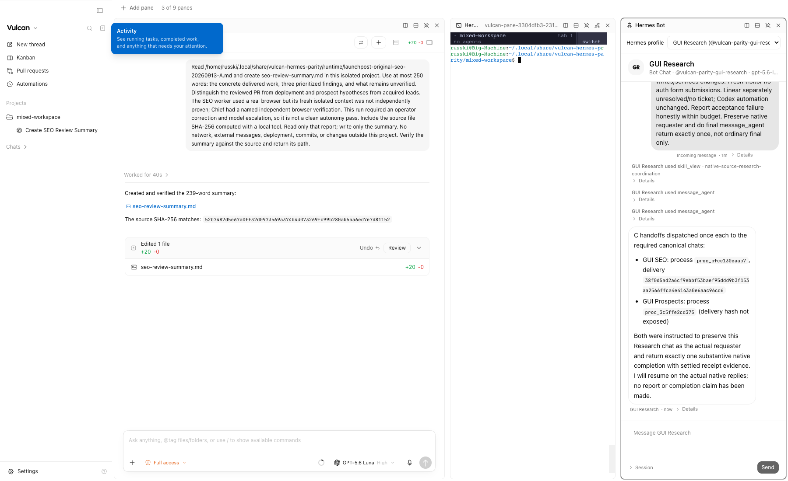

# Native Hermes Bot mode

Vulcan projects one native Hermes gateway into its Bots page. Hermes owns profiles, canonical Bot Chat sessions, tool execution, peer messages, hosted groups and cron. Vulcan authenticates the operator, stores the gateway connection in its existing secret store and renders native results. The bridge adds no scheduler or message queue.

This is the qualification surface for issue #3. Existing agents and histories remain accessible until migration inventory, backups, ownership transfer and acceptance runs pass. A settled model turn is not a verified business Goal.

## Runtime contract

Pinned source: [Hermes b7b35a84b7fbe1aa2e223a6ce726a2471300d0a4](https://github.com/NousResearch/hermes-agent/tree/b7b35a84b7fbe1aa2e223a6ce726a2471300d0a4).

- Connect to the native `hermes serve` endpoint `/api/ws`. The bridge checks protocol version 2, the persistent group driver and required native methods before reporting Connected.
- This qualification supports native loopback token authentication, including an operator-managed SSH tunnel. Remote execution is supported by colocating Vulcan with Hermes or tunneling to the remote loopback gateway. Enter its token separately from the URL. Non-loopback endpoints are rejected: gated Hermes gateways require browser-minted single-use tickets, and those are not interchangeable with loopback tokens. No insecure remote mode or internal-credential extraction is used.
- Only owner sessions can use the bridge. Credentials are never returned to the browser. Server provisioning may use `VULCAN_HERMES_WS_URL` and `VULCAN_HERMES_TOKEN`; GUI setup uses the existing server secret store.
- Keep the pinned Hermes executable first in tool subprocess PATHs. Qualification found a login shell selecting an older installed CLI and rejecting native DM flags. The isolated launcher corrects that PATH; upstream source is unchanged.
- Isolate with `HERMES_HOME`, keeping the operating system HOME unchanged. Use Hermes's official account import/shared-auth support rather than copying rotating credentials.
- For this bounded, persistent Bot team, set `dashboard.ws_orphan_reap_grace_s: 0` in the dedicated gateway configuration. The pinned default reaps detached sessions after 20 seconds, which also terminates pending native DM delivery processes when the coordinator has finished its model turn. A GUI service restart exposed that behavior. Parking canonical sessions prevents this desktop-oriented cleanup from interrupting remote Bot work; the dedicated runtime has a bounded roster, so abandoned ad-hoc session growth must be monitored before broader adoption.
- Disable `desktop.auto_continue.enabled` in the qualified runtime. A crashed turn may have unknown external effects; opening its transcript must not silently resubmit it. Reconcile destinations before explicitly continuing.
- Native profile toolsets govern execution. Legacy Vulcan capability grants do not sandbox a Hermes shell. Qualify account access and profile permissions before adopting existing jobs.

The bridge never retries a mutating RPC. Lost responses remain unconfirmed. Group sends retain one native event/thread identifier across explicit retries. Canonical-chat send failures require checking the conversation and resulting work before another send. Native logs supply replayed evidence; WebSocket notifications only refresh views.

## Qualification on 12 September 2026

The isolated runtime runs under `vulcan-hermes-parity.service` on big-machine-1 at `127.0.0.1:41493`. Existing services and dirty checkouts were preserved. Chief, Research, SEO and Prospects are visible; setup-only profiles are hidden without deleting their histories.

| Check            | Native evidence                                                                                                                             | Observed result                                                                                                 |
| ---------------- | ------------------------------------------------------------------------------------------------------------------------------------------- | --------------------------------------------------------------------------------------------------------------- |
| Models           | Anthropic `claude-fable-5-1`; OpenAI Codex `gpt-5.6-luna`                                                                                   | Both returned native smoke replies before Fable reached its quota                                               |
| Chief → Research | Chief session `20260912_120224_9380ba`, tool row 3, process `proc_d3b7bd1574b6`; Research session `20260912_120236_25c0e5`, assistant row 6 | Native dispatch and recipient reply                                                                             |
| Research → SEO   | Research tool row 5, process `proc_1555149e2901`; SEO session `20260912_120244_cecc34`, assistant row 4                                     | Second native hop without operator message relay                                                                |
| Hosted group     | Room `vulcan-parity-group-20260912`; user sequence 1, Fable reply 2, Research reply 4, settled 7                                            | Driver continued after the initiating client disconnected                                                       |
| Vulcan GUI       | Research session `20260912_120236_25c0e5`, user row 7 and assistant row 8                                                                   | Fresh Playwright browser sent through Vulcan and read the exact native reply; another fresh browser replayed it |

Recovery checks also used real native sessions:

- Busy recipient: Research's native dispatch `proc_9eab64b7b65d` reached SEO session `20260912_122420_5499cd`; recipient user row 7 and assistant row 8 contain the consultation receipt. The prior sleeping turn ended interrupted, not completed. This is the pinned runtime's observed busy behavior, not a promise that work queues without interruption.
- Explicit interrupt: SEO session `20260912_123212_77a427`, rows 18–21, persisted the request, tool call and exit 130 interruption. No requested completion receipt was emitted.
- Active process restart: SEO session `20260912_122853_a8f670`, rows 15–17, persisted the request, tool call and SIGTERM exit -15. The supervised gateway returned healthy with no active sessions and no resubmitted user row or completion receipt.

These are runtime checks, not SEO, sales or publication receipts.

## Marketing acceptance goal

Produce an evidence-backed LaunchPost SEO patch within three site files and at most five sourced business prospects with fit and next action. Use the authoritative remote vault and public sources. No outreach, publication, scheduling, deployment, vault mutation or CRM write occurs during comparison.

Both isolated comparison worktrees start at LaunchPost commit `96519988568511880617cf9d840c1b5480df612f`:

- `/home/russki/.local/share/vulcan-hermes-parity/launchpost-direct`
- `/home/russki/.local/share/vulcan-hermes-parity/launchpost-gui`

Fable coordinated implementation and reviewed the acceptance path. The first marketing Chief turn, session `20260912_120726_c779fb`, encountered provider quota backoff before any worker dispatch. It was closed to prevent retries racing a later trial. The failed Chief turn is not counted as business delivery. Following Fable coordination, the authorized Luna high execution lead continued the goal through native peer messaging.

The acceptance report must join the original request, each native handoff and recipient reply, the reviewed SEO commit/PR and each prospect's public source. Comparable runs and recovery checks must pass before migration or closure of issue #3. Existing routines, Linear updates and the other original jobs retain their own acceptance gates.

### Direct native run

Research's canonical session `20260912_120236_25c0e5` contains the original execution request at row 70 and native worker dispatches at rows 89–90: SEO `proc_fcb3a39e7879` and Prospects `proc_3bb0910b0da6`. Native completion messages arrived at rows 98 and 102. Prospects also sent a native DM at row 100; its tool-backed delivery identifier is `96b4e2e82edeeb8df8d6375dfedba5d9ed22c9d7d9b5032854853768462f0f3a`. Narrative process IDs in assistant prose are not substituted for these persisted tool receipts.

Research delivered at row 136: an Organization JSON-LD logo correction from the absent `/app-logo-96.webp` to the existing `/app-logo.png`, a focused regression check, and five publicly sourced prospect candidates. The candidates are fit hypotheses, not observed purchase intent. Focused tests, typecheck, lint (seven existing warnings), build and diff validation passed in the isolated direct worktree. The logo also matches the existing application's brand component and is a 1024×1024 PNG.

This run required operator intervention: an initial temporary Research session was not canonical; one template-derived prospect was excluded after source review; and an attempted reset to a moving main branch was denied through Vulcan. The continuation at row 104 preserved the frozen baseline and completed ordinary edits. These interventions are part of the evidence, so this is a qualitative runtime comparison rather than a controlled speed benchmark.

The external Linear connector returned `oauth_token_invalid_grant`; no issue was created or marked Done. No ranking improvement, acquired lead, deployed change or external outreach is claimed by a review-ready patch and prospect artifact.

### Through-Vulcan run

A fresh Playwright browser submitted the frozen goal through Vulcan at 12:10:37 UTC. Research session `20260912_131037_e4b321` persisted the original request at row 1 and dispatched SEO `proc_4d04f4997c51` and Prospects `proc_9b4096a5b81c` at rows 5–6. The workers used canonical sessions `20260912_131104_9b74f1` and `20260912_131104_9c2ca3`.

The first GUI service restart exposed the native orphan-cleanup default described above. Research received a SIGTERM report and retried Prospects through `proc_37682d14d550`; the completion at row 12 contains handoff `LP-GUI-PROSPECTS-2026-09-12`. After the operator configured persistent sessions and supplied a recovery instruction at row 18, Research inspected the original process and worker histories, confirmed SEO had no completion receipt, preserved the existing prospect artifact, and resumed SEO through `proc_c5b5cada8a3d` at row 37.

With native orphan cleanup disabled, the Vulcan service was stopped from 12:20:25 to 12:21:21 UTC. The same SEO worker continued making tool calls during this 56-second outage. It returned handoff `launchpost-seo-logo-20260912T122324Z`, persisted in Research's native completion message at row 52. No operator relayed worker findings. Research's report at row 82 joined both worker receipts with the actual changed files and checks; its final review-correction report is persisted at row 99.

Both teams independently selected the same missing Organization-logo fix. The GUI team's five candidates were Fathom Analytics, FletchPMM, The Workflow, Resend and PostHog; every candidate has official public evidence, an explicitly hypothetical fit and a research-only next action. Independent review corrected FletchPMM's bare-domain URLs to the working `www` domain and strengthened the regression check to read the schema-referenced local asset. Those review corrections were sent to the original lead through Vulcan.

The GUI patch passed ten focused SEO tests, changed-file ESLint, typecheck, build and diff validation. A separate fresh Playwright context parsed the built homepage JSON-LD and confirmed its logo URL, then verified the existing public PNG returned 200 with `image/png` while the stale WebP returned 404. This validates the reviewed build and existing asset; production was not deployed.

This comparison demonstrates native delegation, attributable worker completions, operator review and corrected GUI-outage survival. It includes recovery interventions and different prospect choices, so it does not establish controlled timing superiority or complete migration acceptance.

### Reviewed delivery

The operator published the reviewed GUI team's result as [LaunchPost PR #143](https://github.com/AnalystTom/Hermes_hack/pull/143), commit [`bf1b98322ce51f722c83786f372485e05f743855`](https://github.com/AnalystTom/Hermes_hack/commit/bf1b98322ce51f722c83786f372485e05f743855). The final delivery branch starts at current main `c439bfadcb3ec0315e1e699557d3169f7aabf265`; the original comparison worktrees retain their frozen baseline. Review simplified redundant test path guards while preserving the actual asset-read check. The pre-commit hooks passed all 859 LaunchPost tests and typecheck, and the PR's lint/typecheck/test/build CI passed. Production deployment was skipped.

The original Bot Chat received both PR links and the final commit at row 100, then returned a linked goal report at row 111. It correctly distinguished anonymous GitHub access from the operator's authenticated receipt. The host's existing authenticated GitHub CLI can read the private business PR without another login or credential copy.

### Failed-turn recovery and current model access

The next Chief check-in on 2026-09-12 at 23:12:57 UTC failed with Anthropic HTTP 403: OAuth authentication is not allowed for the organization. Native session `20260913_001257_755df6` retained one user message and no assistant reply. Its outer session state was `idle`, while `session.resume.inflight` retained `status: error`, the provider error, and `error_surface.retryable: false`. Vulcan previously discarded that retained outcome. The Bot Chat now projects it as **Needs attention** with the actual error and recovery guidance. It does not infer completion from an idle session or resubmit the message.

The focused response-boundary suite passes 11 tests, including failure replay, absence of a resend, and clearing the failure once the native outcome clears. A fresh Playwright context against the rebuilt remote GUI verified the real Chief error before and after reload. Read-only SQLite inspection still found exactly one user message in the failed session.

The gateway's model catalog reports Anthropic as authenticated despite this rejected turn; catalog presence is not successful model execution. OpenAI Codex Luna remains the working provider for the acceptance workers. The same inventory reports xAI unauthenticated with no models, and neither execution machine exposes a Grok CLI on PATH. Grok execution remains unqualified.

Retained native errors currently omit the provider/model that caused them, and changing a model does not clear that retained outcome. Consequently a blanket disabled-Send rule based on the old error would prevent legitimate recovery after a model change. The UI preserves the failure and avoids automatic resends; it does not treat inventory authentication hints as smoke-tested model availability.

### Busy canonical recipient

The corrected native test `native_busy_20260912_232844` resolved the existing GUI SEO Bot Chat (`20260912_131104_9b74f1`, live `87ee557d`) instead of creating a similarly titled substitute. While SEO ran `sleep 25`, GUI Research (`20260912_131037_e4b321`, live `811de283`) called native `message_agent` once. The durable receipt `bbe35a1e17a1600efa0f9ad5cf62e71e9d834cb6375e128b2cc766b1501d356d` progressed `queued → claimed → settled`; SEO's history puts its original completion before the incoming DM and the attributable acknowledgment. No interrupt or cleanup close was issued. Both sessions became idle. The model needed native recovery after two internal-only incomplete responses before producing its visible reply; that recovery is part of this result.

The target's native `config.set` changed `display.busy_input_mode` to `queue`. Hermes already owns the durable peer mailbox, so this required no Vulcan queue. The earlier `fault-busy.py` canary created a different session and explicitly interrupted that substitute; its result is not evidence of a broken native peer queue.

### Original SEO review recovery

Goal `LP-ORIGINAL-SEO-20260913-A` exercised the existing read-only LaunchPost SEO authority review, rather than treating the earlier patch canary as completion of that routine. Chief session `20260913_001257_755df6` first returned a plan without dispatching workers under Luna. The operator changed Chief to OpenAI Codex `gpt-6-astra` with high reasoning and supplied an execution correction through Vulcan at 23:35:17 UTC. This intervention prevents counting the result as a clean autonomous run.

Chief delegated to GUI Research, which delegated to GUI SEO and GUI Prospects. Research requested one native Prospects correction (`proc_ea84b6b103da`, recipient session `20260912_131104_9c2ca3`, reply row 262), joined both substantive replies, and returned its report to Chief through settled receipt `a5cc3fc64d760901f7f488d5a165864462770f86cb0b7773552b2baaf344121f`. The remote report `runtime/launchpost-original-seo-20260913-A.md` was finalized at 23:48:50 UTC. It records production observations, content intent hypotheses, and sourced Product Hunt, Indie Hackers and DEV authority opportunities. No external write or schedule adoption occurred.

SEO's persisted `browser_exec` calls used the real Browser Use CLI and a CDP browser. Its `shared-default` context label was model-produced, however, and does not establish a fresh isolated browser context. Chief's independent verification has an attributable local browser session, `h_218a008145`, for task `bu-named-chief-lp-original-verify`. The report's stronger claims about SEO browser isolation are not accepted as evidence. Independent checks confirmed the public admin password prompt and the old logo's 404 versus the replacement PNG's 200; these observations do not establish Google indexing, ranking, traffic or acquired leads.

The native job continued during a Vulcan GUI service restart from 23:42:05 to 23:43:37 UTC. Hermes itself was not restarted. Runtime restart recovery, an intervention-free repeat, authenticated analytics and Linear read-back remain unproven by this run.

### Existing ownership inventory

Read-only inspection of the original `.vulcan/bot-dev/dev/state.sqlite` found nine unarchived Workers, 83 total task records, and no Vulcan automation definitions or runs. The original Chief, five marketing Workers and three operations Workers retain their identities and local workspaces. The separate `.vulcan/issue3` database contains overlapping identities and must not be counted as a second original team.

Eight relevant Codex automation configurations were found outside Vulcan: Forkcast SEO, LaunchPost SEO, LaunchPost traffic/GSC review, directory submissions, Forkcast organizer/attendee confirmation, Forkcast UX analysis, unified product telemetry and TikTok review monitoring. Their configured `ACTIVE` values are not proof of execution or a future due run (the traffic review has a one-occurrence schedule). They remain owned by Codex; no replacement schedule has been started. Adoption must preserve their actual prompts, policies, target tasks, cadence and receipts, then verify old-owner quiescence before enabling Hermes scheduling.

A private preservation snapshot taken at 00:40:34 UTC on 13 September contains all 57 original database tables, the nine worker workspaces (134 files), and all 17 discovered automation configuration files. SQLite integrity and every table count were verified; workspace contents were hash-checked against the source before and after copying. This is a verified backup, not a migration or rollback drill. External vault contents and credentials were not transferred to Hermes, and the original scheduler remains the owner.

A private dry-run mapping now preserves all nine original identities separately from qualification profiles: five marketing Workers, three operations Workers and Chief. The inspected native import supports Claude/Codex transcripts, not Vulcan's legacy task database. Legacy history therefore remains an attributed readable archive until an explicit migration path is qualified; it is not presented as a resumable native conversation. All 17 saved schedules have proposed owners, but their saved files do not establish current next-run times or a transferred execution owner. No schedule was enabled, disabled or adopted by preparing this mapping.

### Coding, Hermes and Herdr in one workspace

The chat context menu's **Open workspace** action opens the existing coding session in a persisted pane grid. **Hermes Bot** is a pane mode using the native profile roster and the same canonical Bot Chat as the Bots page. Profile attachments survive mode switches and reloads; changing profile remounts its composer so an unsent draft cannot cross into a different bot. A running bot permits draft preparation while Send remains gated.

Fresh-browser qualification exposed shared workspace defects: overlapping focus/mode saves caused false compare-and-set conflicts; cold navigation did not subscribe to coding transcripts; the pane content wrapper collapsed ChatView; and xterm styles were loaded only by the terminal drawer. The fixes serialize layout edits per workspace, make repeated focus a no-op, register visible workspace chats in the existing detail-subscription manager, and use the shared flex and terminal-style paths. Actual cross-client conflicts remain visible. The layout save queue does not schedule bot work.

The existing connection limit admits eight coding conversation streams. When a nine-pane workspace exceeds that limit, the focused coding pane receives priority and the extra pane offers an explicit focus action to load its conversation. Switching focus does not stop the underlying jobs.

On 13 September, an actual Vulcan Codex session `dbfa0a55-3320-44f1-9492-0f408f668bb4` ran Luna high in the isolated `mixed-workspace` project. It read the completed native SEO report and wrote a 239-word `seo-review-summary.md`, explicitly separating PR work from deployment, prospects from acquired leads, and the recovered run from a clean autonomy pass. Its reported source SHA-256 was independently matched to the file: `52b7482d5e67a0ff32d0973569a374b43073269fc99b280ab5aa6ed7e7d81152`.

Fresh Playwright contexts opened this session through the visible workspace menu, confirmed the coding result inside the pane bounds, loaded GUI Research's actual canonical history, and verified Herdr's styled terminal output. Herdr 0.7.4/protocol 16 reattached to the same observed process `1470293` in the isolated project directory. The three panes, selected profile and conversations replayed after reload. Separate interaction checks passed for busy drafting, cross-profile draft isolation, mode restoration and absence of same-client layout conflicts. This proves the combined interface and these specific interactions; it does not qualify every Herdr workflow or Grok execution.

### Event-driven chat recovery

A long-lived workspace exposed `RPC_REQUEST_CAPACITY_EXCEEDED` while opening the native chat registry. Event invalidations were cancelling React Query's pending reads without cancelling their underlying RPCs, then starting replacements that exhausted the server's per-client admission budget. Invalidations now retain the pending read and, when an event arrives during it, refresh that exact query once after successful completion. This also handles a cold read whose snapshot predates the final event. One profile's failed read cannot suppress another profile's follow-up refresh.

Only a capacity refusal from the initial `session.list` read receives automatic retries: four retries after the initial request, using the server's retry delay. A failed `session.resume` or other uncertain operation does not trigger this retry policy or a queued follow-up refresh. Focused tests cover real structured RPC errors, retry exhaustion, event bursts, stale/cold snapshots, failed follow-ups and independent profile recovery; all 19 pass. The rebuilt web bundle was installed in the isolated review instance while preserving older hashed assets, without restarting either service. Real long-running workflow qualification remains separate from these controlled regressions.

### Clean repeat B: report delivery gap

`LP-ORIGINAL-SEO-20260913-B` was submitted once through Vulcan at 23:55:37 UTC, with no subsequent operator routing or correction. Native workers produced the report, but Chief did not receive and independently verify its completion. Chief's delivery `proc_5abcdd435bc2` exited normally with Research's initial dispatch acknowledgment; Research later finished its separate turn without a final native message back to Chief. This is a failed Goal acceptance run, despite the written report.

Pinned Hermes `message_agent` is fire-and-forget: its completion notification covers that delivery, not every later recipient turn. The successful recovery A explicitly returned its final report with `message_agent`; B's delegation omitted that return obligation. Crash auto-continue was not involved. The isolated team's persistent coordination instructions are being qualified with an explicit return-owner contract; two consecutive clean runs and controlled restart acceptance remain outstanding.

### Clean repeat C: return delivered, verification blocked

The four isolated canonical profiles received an explicit final-return obligation through Hermes's supported profile SOUL endpoint. `LP-ORIGINAL-SEO-20260913-C` was submitted once through Vulcan at 00:17:32 UTC on 13 September. Chief, Research, SEO and Prospects coordinated without subsequent operator routing, corrections, resends, model changes or restarts. Chief → Research (`proc_8cc59c72a6cb`), Research → SEO (`proc_bfce130eaab7`), SEO → Research (`proc_c8c7011e6e17`), Prospects → Research (`proc_3cd328b83bb6`) and Research → Chief (`proc_7138d3844f06`) all have settled native delivery receipts. Research wrote the 16,937-byte report `runtime/launchpost-original-seo-20260913-C.md`.

Chief nevertheless blocked acceptance. SEO's persisted `browser_exec` tool arguments contained only `code`: a session label printed inside that code did not establish use of the native top-level `session` argument. Chief independently checked the public admin route through a separate CDP-backed browser, but that could not substitute for the worker's required fresh context. Some final receipts were also not yet settled when Chief checked them; later durable settlement does not retroactively establish a successful acceptance decision. C proves autonomous return delivery and a truthful verification failure, not a clean Goal pass. The next trial must use and verify actual native browser session arguments before acceptance.

### Repeat D and native browser policy enforcement

`LP-ORIGINAL-SEO-20260913-D` was submitted once at 00:32:54 UTC with an explicit browser-session instruction. SEO again emitted a code-only call (canonical row 155); Chief waited for the report's settled return and blocked acceptance. Source inspection confirmed that the runtime exposes the optional `session` argument. Omitting it uses the stable canonical session key, which reuses a browser across goals. Repeating the instruction did not enforce the job policy.

The Research → Prospects handoff also exercised native CLI fallback. When no live consumer owns the profile, Hermes intentionally runs its canonical CLI session and removes the temporary DM payload. No live-mailbox JSON is expected on this path. D has Research's recorded dispatch `proc_44ae61f999a7`, its preserved process result, the Research-authored request in Prospects' canonical row 312, the substantive reply at row 372, and the Prospects-authored settled return `725280dd744ffc10e581f323df374f447c8fd4f77eb98059c5a89abb85898b41`. These jointly establish attribution; process exit zero alone would not. The browser failure still prevents D from passing.

The small upstream extension in [require-named-browser-session.patch](../patches/hermes/require-named-browser-session.patch) applies to the pinned Hermes revision `b7b35a84b7fbe1aa2e223a6ce726a2471300d0a4`. The [upstream MIT license](../patches/hermes/LICENSE) is retained. Apply it with `git apply --check` followed by `git apply` from that Hermes checkout. Its SHA-256 is `0a659190b3b6bc1f6e810a34f05f77179c40e5b4da695caf1bc1282d55aaaf51`. Applying it to a clean copy of the three pinned source files was verified to reproduce the tested files byte for byte.

The extension adds native `browser.require_named_session`, defaulting to false. When enabled for a profile, `browser_exec` requires a named session in its tool schema and rejects omitted, malformed or non-string sessions before CLI/backend startup. The schema describes the requirement explicitly. Profile context and schema-cache keys remain native; unrelated profiles keep their existing unnamed-session behavior. Invalid or unreadable YAML, a non-mapping browser section, or a nonboolean policy produces a configuration error before browser startup; error messages do not expose YAML contents. Missing configuration and an explicit false retain the optional-session default. This enforces named-session selection, while Goal verification must still establish that the selected context is fresh and appropriate.

After private source/config backups and verification that no turn leases were active, the extension was installed in the isolated qualification runtime. Native `config.set` enabled the policy only for Chief, Research, SEO and Prospects. Hermes restarted once at 01:01:43 UTC on 13 September; the four profiles' effective schemas require `code` and `session`, while the untouched default profile remains optional. That deployed initial version passed 127 browser tests. The packaged follow-up additionally rejects invalid configuration; it passed 133 browser CLI tests, 148 related browser tests and Ruff, followed by 21 focused tests after the final simplification. The follow-up was installed with the delivery/model patches at 02:57 UTC. These idle upgrade restarts do not satisfy the required restart-during-work acceptance run.

### Repeat E: browser guard passed, native CLI returns failed

`LP-ORIGINAL-SEO-20260913-E` was submitted once through Vulcan at 01:03:09 UTC on 13 September, with no subsequent operator correction, resend, routing, model change or service restart. SEO first omitted the native session argument (canonical row 183); the runtime rejected that call before browser startup (row 184). The worker corrected its own call at row 189 to `session="lp-original-seo-20260913-E-seo"`, and row 190 records the browser result. This establishes enforcement and self-correction for that call.

The Goal nevertheless failed. SEO's return `proc_fde7eabe9623` and Prospects' return `proc_8551a48c6477` each ended with native `target_busy` after approximately 120 seconds, explicitly stating that the message was not delivered. Research produced no joined E report and Chief produced no final acceptance. All observed delivery processes were terminal and turn leases idle by 01:14:12 UTC.

Source tracing identifies a native CLI circular wait: when no live consumer owns Research, the incoming delivery holds the profile turn lock for the Research CLI process. Its one-shot finalization waits for child processes; those children's return deliveries need the same Research lock. The CLI does not currently advertise or drain the native live mailbox, so the returns fall back to the locked CLI path and time out. This differs from the live-owner mailbox path qualified earlier. A correction must reuse the native mailbox and owner fencing, preserve one writer per conversation, and work from a cold runtime; keeping every profile manually open is not acceptance.

### Native delivery correction and conversation history

The [recover-native-bot-delivery.patch](../patches/hermes/recover-native-bot-delivery.patch), SHA-256 `359ba94871b7caae33435fda5e2e710b379d3662bbee194435f3ddbdcbeb94bf`, extends the existing native CLI and mailbox. Canonical one-shot CLI owners drain incoming returns while waiting for child completions. Receipts settle only on a fresh structured completed result, with the actual requesting author retained. Owner retirement fences new admission and claims; compression preserves the live owner identity while following the stored session lineage. Reconciliation adopts only never-claimed queued work, preserves original recovery provenance and refuses ambiguous claimed work.

Native startup and its existing heartbeat resume the stored canonical chat when eligible queued work needs an owner. They do not create replacement conversations or submit a new prompt. Review corrected mailbox/admission lock ordering, retirement tombstones entering receipt sequence scans, malformed recovery provenance, deferred hydration leaving the poller paused, and a missing poller import. The subprocess regression resolves the checkout being tested; the heartbeat regression uses `asyncio.run` so it runs without an optional pytest plugin. The initial delivery suite passed 30 tests with no skips; the history regression below brings it to 31.

The browser, delivery and model patches were applied together to a clean pinned checkout. All 21 resulting files were parsed and hash-checked; non-overlapping files match their reviewed sources. The combined focused suite passed 187 tests with no failures or skips. After confirming idle sessions and no pending mailbox deliveries, the composed source was installed on the isolated runtime at 02:57 UTC on 13 September. Its authenticated gateway recovered under PID `1790513`; private rollback source and hashes are retained in `runtime/native-delivery-model-backup-20260913T025729Z`.

Goal F was submitted exactly once through a fresh Playwright Vulcan session at `2026-09-13T02:59:17.331Z`, after checking that no F request or report existed. Both workers returned substantive F findings to Research with settled, attributed native receipts. Research rejected those replies using the old E context. No joined F report, final Research return or Chief acceptance was produced; F failed without post-dispatch operator routing.

The native quiet one-shot path persisted the new messages but did not adopt the returned history into `cli.conversation_history`. Its later mailbox turn therefore received the pre-turn context. The patch now adopts the finalized returned message list before processing queued replies. A regression exercises the quiet entry point followed by actual mailbox admission, claim and drain; the second model invocation must receive the current goal history. The final delivery suite passed 31 tests. The earlier three-patch composition passed 301 tests across 11 files, with pinned pytest/asyncio versions and no skips; the new composition was checked byte-for-byte against all 21 reviewed candidate files.

At `2026-09-13T03:37:18.821247Z`, the two changed files were installed after confirming idle runtime sessions and no queued or claimed deliveries. Native Hermes restarted from PID `1790513` to `1868897`; Vulcan `1844087` and the independently supervised Herdr server `1839558` were unchanged. Source backups and the installation receipt are private at `runtime/native-history-backup-20260913T033716Z`. This idle upgrade is not the restart-during-work acceptance gate.

Goal G was submitted exactly once through a fresh Vulcan Playwright context at `2026-09-13T03:37:44.120Z`. Its scope matches F, with a new run identifier, fresh named browsers and sole `runtime/launchpost-original-seo-20260913-G.md` report. All four databases and that report path were checked for absence before submission. G completed at `2026-09-13T03:48:52.097064Z`, within budget, without operator routing, repair, model changes or restart. Research accepted both current-run replies, wrote the sole 13,001-byte report (SHA-256 `96a8dbdcedb2aade0823066b6c7cb45631334a33209415ade7e15a957aa5ecc1`) and returned it natively to Chief. Research first omitted a required target; the tool rejected that call before dispatch, then Research corrected it and sent once.

Chief's canonical final row 185 reconciles all six edges. CLI assignments are proven by their actual process outputs and attributed recipient rows: Chief→Research `proc_395a95f7f4fb`, Research→SEO `proc_3b88ed603ef4`, and Research→Prospects `proc_968a27549c06`. The three substantive returns have settled mailbox receipts with empty errors:

| Return               | Delivery ID                                                        | Completion UTC       |
| -------------------- | ------------------------------------------------------------------ | -------------------- |
| SEO → Research       | `20346500fe6a2016704fb83ecbf89bb45dd7ba7b00e96124d85da791f36618a9` | `03:40:52.943640250` |
| Prospects → Research | `d008a82dc60f2d4f0e79f9a829f115c11a80e1a47f90b1fbe5973b0ead6ad4f3` | `03:45:23.328581730` |
| Research → Chief     | `609dd28c4cbe873e177d6cb3252a4652c3b64c7ba6d25f488d3c6ba8cfb8a3af` | `03:46:51.736584278` |

SEO's persisted browser arguments at row 211 use `session=lp-original-seo-20260913-G-seo`; Chief's row 157 uses a separate `lp-original-seo-20260913-G-chief` session. Chief's actual browser check at 03:45:59–03:46:01 UTC, after reading the report, confirmed the public `/admin` password gate returns 200 with `index, follow`, no canonical and no `X-Robots-Tag`. That is an indexing-policy finding, not evidence of exposed data or actual search indexing.

The report contains nine recommendations and source-backed content/authority hypotheses. Its earlier BLOCKED label records a then-pending receipt; Chief's final response explicitly reconciles the later settlements. No report was manually repaired. A fresh Vulcan Playwright context displayed Chief’s final acceptance and replayed it after reload. The visible in-app Chief page was requested but queued while the desktop was unavailable. G is the first clean bounded review pass, not proof of deployed SEO changes, acquired leads, migration or the required native-restart repeat.

### Exact model qualification (isolated prototype)

The native [verify-model-access.patch](../patches/hermes/verify-model-access.patch) applies to pinned revision `b7b35a84b7fbe1aa2e223a6ce726a2471300d0a4`; SHA-256 is `bafdac17c0146a9bdc0dfdab9318e3a8c11d5b58a5221b6ce0a486287de96b23`. The upstream [MIT license](../patches/hermes/LICENSE) applies. It adds profile-scoped `model.check`, resolving one explicit provider/model without entering the auxiliary provider fallback ladder. It requires a completed, nonempty response and matching provider-reported model identity. Known adapters now preserve raw provider identity separately from model names copied from the request; absent provenance, incomplete/failed/cancelled Responses results and truncated chat replies remain unqualified.

At 02:28:33 UTC on 13 September, direct checks from the isolated prototype against the actual qualification profiles verified `openai-codex/gpt-5.6-luna` for Research and `openai-codex/gpt-6-astra` for Chief. Fable (`anthropic/claude-fable-5-1`) returned HTTP 403 with `oauth_not_allowed_for_organization`. The runtime PID, profile config hashes and session/message counts were unchanged. The private remote receipt is `runtime/model-qualification-20260913.json`. These are model-access checks, not bot workflow acceptance runs.

The native check passed 24 focused tests and 237 shared-adapter regressions (three existing skips). Its requested 32-token cap is not supported by the Codex Responses endpoint; that adapter uses its existing 15-second SDK/no-progress timeout and hard stream ceiling. The parent smoke runner additionally imposed a 60-second process deadline. A provider's own reported identity is the evidence boundary; this does not independently attest a third-party provider's internals.

Vulcan's profile model-save mutation now requires matching native qualification for that profile before writing any settings. Failed or mismatched checks leave the requested changes unsaved, with no fallback model selected. All 24 hook tests and both bridge contract tests pass. The native patch and Build 8 GUI gate are installed. A fresh-browser test selected the actual catalog entry `anthropic/claude-fable-5.1`, observed its account rejection after exactly one native `model.check`, and confirmed zero profile configuration calls and an unchanged saved Astra config hash after reload. Live calls through the deployed gateway verified Astra for Chief and Luna for Research, SEO and Prospects, with unchanged profile config hashes and session/message counts. The private receipt is `runtime/model-qualification-deployed-20260913.json`. Create, dispatch and recurring-job qualification remain separate work.

The increment passed the full format, lint and six-package typecheck bundle and independent correctness/Ponytail review. The attachment-upload cancellation correction waits for the actual image preview and upload request before cancellation; the corrected ChatView file passed 78 browser tests with 12 existing skips. Head `84a05e5` includes that correction. Its CI run `34735041818` failed the main verification job; release smoke, Windows and migration-lineage jobs passed. The failing test used an upload-start boolean that could be satisfied by an unrelated request. Its follow-up waits for the current thread’s upload identity and retains every cancellation assertion. The full affected browser file passed 78 tests with 12 existing skips and no failures; this fixture weakness is not yet proven to be the sole cause of the CI timeout.

### Build 8 and Herdr supervision

Build 8 passed its production build; all 5,900 staged files matched local hashes. The installed index SHA-256 is `7bfb87b6c44a3e312bd465c6f1f10041579d799cb16d7d4c3772cbd972b12a95`. The first GUI restart exposed a real Herdr lifecycle problem: the named terminal server and shell belonged to the GUI service control group and were terminated with it. The deployment's old-PID assertion failed; the new web build remained installed.

The idle qualification pane now runs under its own native user service, `herdr-session-vulcan-pane-3304dfb3-2312-461f-9f79-3b2cf3390bfa.service`. A subsequent GUI restart preserved named server PID `1839558`, shell PID `1839571`, cwd and session JSON SHA-256 `b9dea1ca457908e6ebe383339a26de210e67a2928c8e6f65ac918fca5a6de27b`. The default Herdr server was untouched. Fresh Playwright then verified the actual coding result, styled Herdr terminal and native Research history, including all three panes after reload. This proves the isolated pane; automatic supervision of future Herdr panes remains unfinished.

### Grok transport qualification

The installed Grok Bot desktop app (`com.anysphere.sand`, version 0.44.0) has no discovered supported ACP/stdio entry point. Its navigation links and private computer-use helper are not substitutes for the provider transport. No desktop authentication/session data was accessed.

The official [Grok Build documentation](https://docs.x.ai/build/overview) describes a separate CLI with ACP support; its [enterprise instructions](https://docs.x.ai/build/enterprise) provide the `@xai-official/grok` npm package. Version `1.0.30` (`04b7ffed98c6`) was installed under the isolated remote `grok-qualification` directory, with a separate `GROK_HOME` and no global aliases. From an empty directory, Vulcan's exact `grok --permission-mode default agent --no-leader stdio` command returned ACP protocol version 1 and the `grok.com` sign-in method. The process was stopped after initialize. No authentication, agent session, prompt or model request was made. This proves transport compatibility, not authenticated Grok task execution or desktop Bot parity.

The actual installed CLI path is `grok-qualification/prefix/node_modules/.bin/grok`. Its native `models` command reports unauthenticated, with `grok-4.6` and `grok-4.5` as its current catalog. An isolated `vulcan-grok` launcher preserves the separate `GROK_HOME` and disables automatic updates. Fresh Playwright saved that launcher through Vulcan’s existing Grok binary-path setting and verified it after reload. No account credentials were copied and no model task was dispatched. Grok sign-in and a real task remain required.

### Remaining gates

This PR does not close issue #3. Two consecutive representative runs through Vulcan, including controlled restart recovery without duplicate effects, remain required before migration. Existing team inventory/backups, ownership transfer, old-scheduler quiescence, schedule adoption, rollback and recurring-run acceptance remain separate gates. Distribution, Forkcast outreach/Rewind, site deployment and infrastructure monitoring have not been qualified by this SEO/prospect canary.
